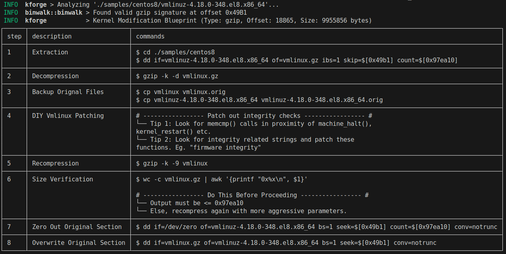
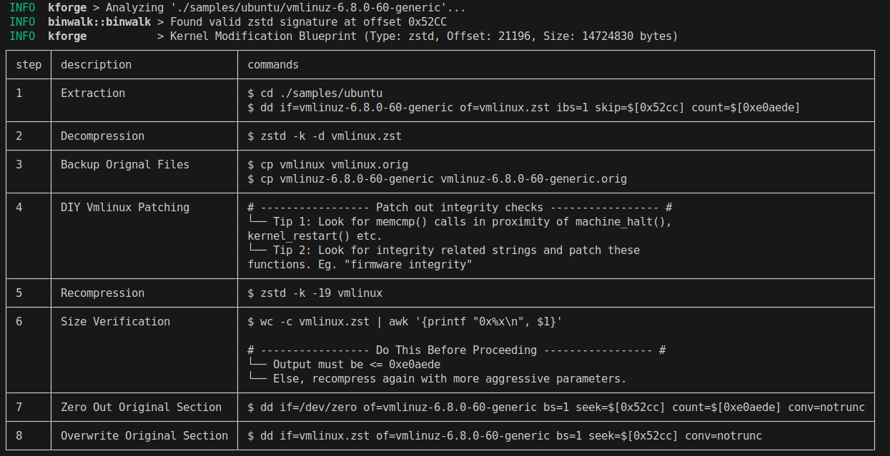
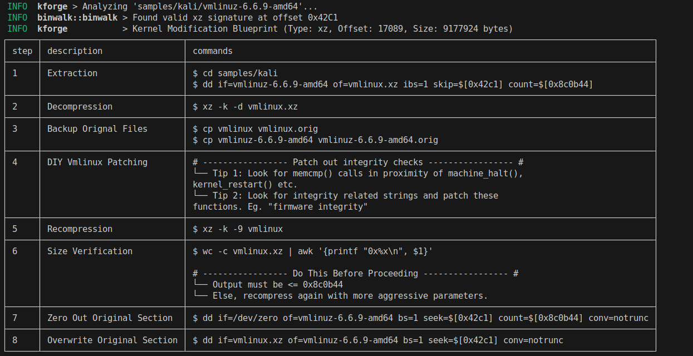
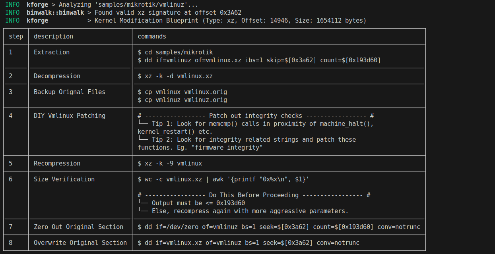

# KForge
KForge takes in a compressed kernel and returns a step-by-step process of kernel patching without the source code. It is especially useful when customizing firmware for embedded devices.


## 1. Releases

The latest static binaries are available [here](https://github.com/mathscantor/kforge/releases/latest).

## 2. Compiling From Source
> [!NOTE]
> The following assumes you are running Ubuntu, or an Ubuntu-based operating system

### Step 1
Install the Rust compiler:
```bash
$ sudo apt install curl
$ curl --proto '=https' --tlsv1.2 -sSf https://sh.rustup.rs | sh -s -- -y
$ . $HOME/.cargo/env
```
### Step 2
Install build dependencies
```bash
$ sudo apt install build-essential libfontconfig1-dev liblzma-dev
```
### Step 3
Compile `kforge`.
```bash
$ git clone https://github.com/mathscantor/kforge
$ cd kforge
$ cargo build --release
# Alternatively, you can also compile statically
$ RUSTFLAGS='-C target-feature=+crt-static' cargo build --release --target x86_64-unknown-linux-gnu
```
> [!TIP]
> The compiled binary is at `./target/release/kforge`

## 3. Usage
```man
Usage:
  ./kforge [OPTIONS]

KForge v1.0.0 takes in a compressed kernel and returns a step-by-step process
of kernel patching without the source code. It is especially useful when
customizing firmware for embedded devices.

Optional arguments:
  -h,--help             Show this help message and exit
  -v,--verbose          Show debug logs
  -f,--file FILE        The filepath of the compressed kernel (Eg. vmlinuz)
  -V,--version          Prints the version of KForge
```

## 4. Examples
### 4.1 Centos8

### 4.2 Ubuntu

### 4.3 Kali

### 4.4 Mikrotik
